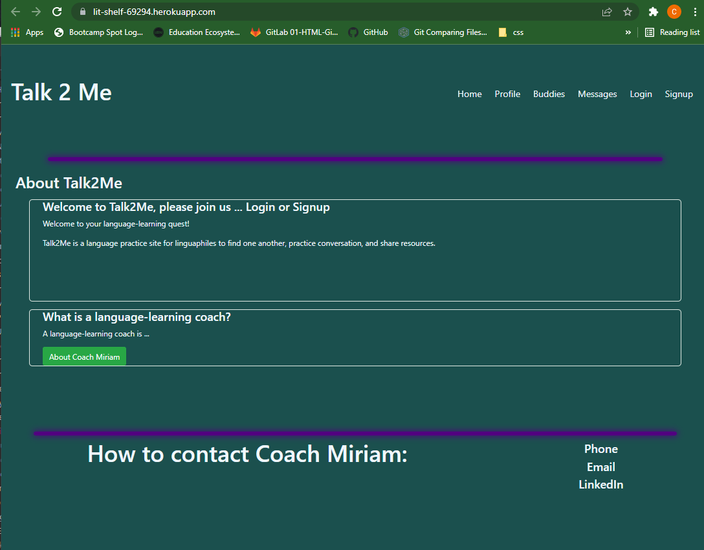
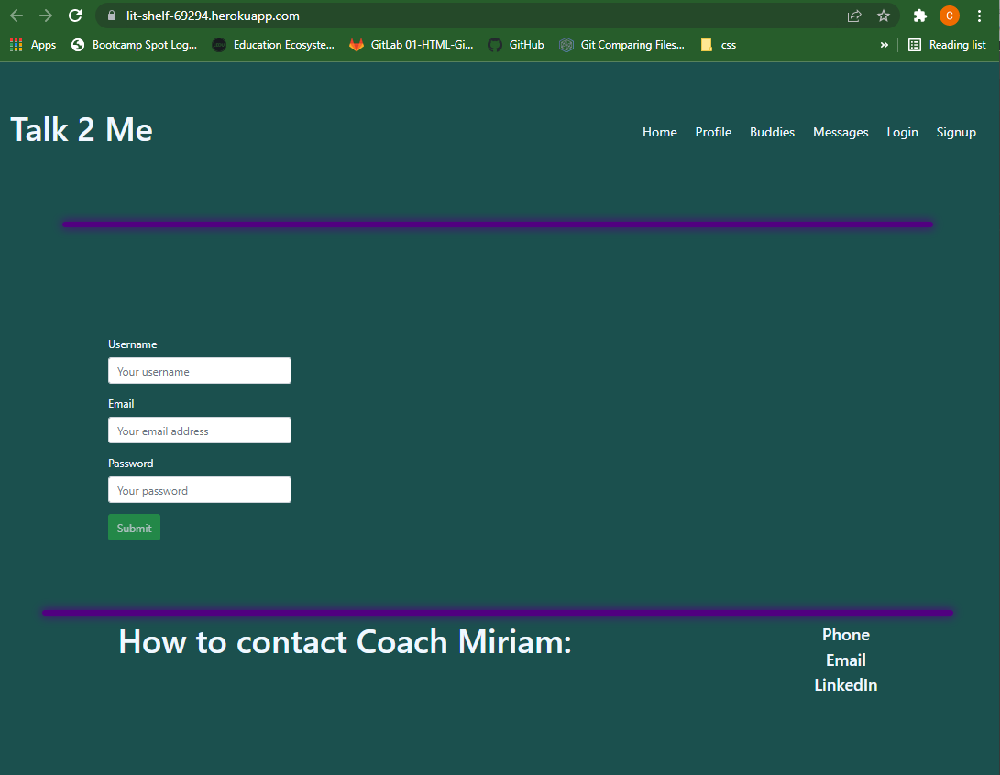
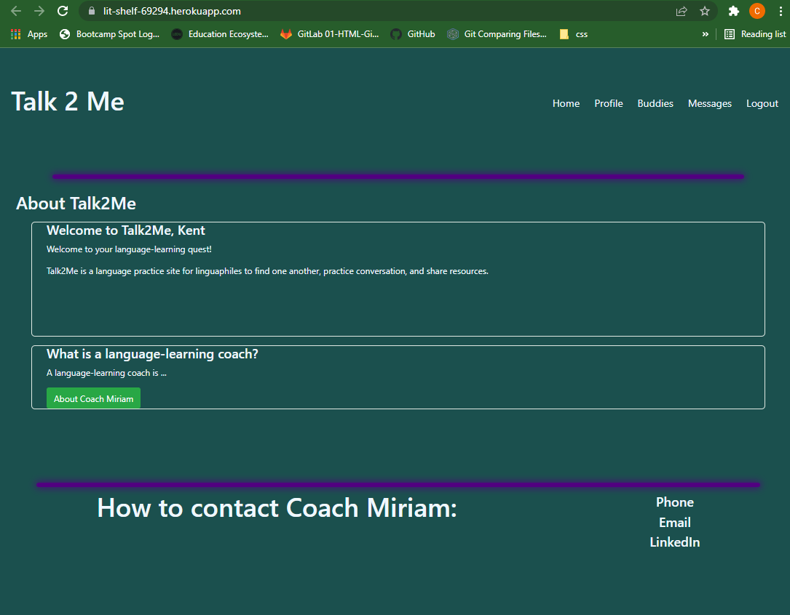

# Talk2Me
This is a language practice site to help linguaphiles to find one another, 
make opportunities for conversation practice, and to share resources.

## User perspective
```
At a time when large numbers of smart, ambitious people around the globe are
entering career fields in science and technology, there is one spoken language
that serves as the essential common mode of communication for people from all
countries and cultures.  That language is, of course, English.

To be able to communicate effectively in a language, one must be able to use
phrases unambiguously, with accurate usage of denotation, connotation, and idiom
to avoid cross-communication.

The only way to achieve this is by practice.  For most, the trickiest thing
is finding conversation partners.  On this app, we hope to simpify the search.
```
## Motivation
```
Many second-language speakers of English have learned the language by studying
it in classes and textbooks before experiencing everyday conversation in a
country where English is spoken.

Speaking and understanding spoken language
uses a different part of the brain from that used in studying,
reading, and writing.  That part of the brain uses "declarative"
memory, the "dictionary" part of the brain.  Unfortunately, it
is not easily available to the speaker during conversation, which accounts for the
difficulty of transitioning to live conversation after years of studying, reading,
and writing the language.

The intention for this site is to help language lovers improve their conversational
fluency by practice with native speakers of English as well as other English learners.

The purpose of conversation is to share ideas and experiences.  Let's focus on that!
```

## Menu options:
### Home
* How to use the site
### Profile
* User creates a profile with background, interests, and contact information
### Buddies
* User can find language conversation buddies and send text messages
### Messages
* User can read messages that have been recieved
### Signup, Login, Logout

## Home page appearance (before signup)


## Signup page


## Home page appearance (while logged in)


## Technologies
* MERN Stack
* Single-Page
* React
* Apollo GraphQL
* Node.js
* Express.js
* MongoDB
* Mongoose ODM
* Uses queries and mutations
* Deployed on Heroku
* Responsive
* Interactive
* Authentication (JWT)
* Protects sensitive API key info
* Components from react-bootstrap: Container, Form, and Button

## Challenges and successes
* React and GraphQL
* It appears that it will serve a vital need in the real world

## Future development
* Filter to select by profile fields
* Page for resources
* Consider adding a live text chat feature
* Consider adding a video chat feature
* Progressive Web App

## [Repository](https://github.com/CChampness/Talk2Me)

## [Deployment](https://moremessages.herokuapp.com/)

