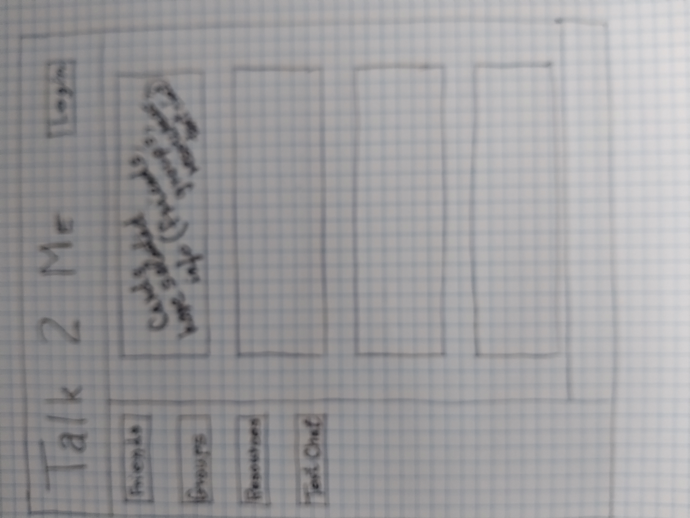

# Talk2Me
Language practice site for linguaphiles to find one another, practice, and share resources.

## Home page appearance (before signup)
* Nav bar:
```
 - Signup / Login
 - About
 - Link to The Professor's latest blog post
 ```
* Main section:
```
 - Photo of The Professor
 - Bio of The Professor  
```
* Footer:
```
 - Contact info
```

## Signup page
```
- Username
- email
- password
- profile details (these are all optional, but to whatever extent
                   the user wants to participate, some or most are needed)
-- Interests
-- Language(s)
-- Mastery levels
--- Checklist of skills 
---- Reading level
---- Writing level
---- Grammar level
---- Pronunciation
---- etc.
-- Sex
-- Age
-- Country of origin
-- Country of current residence
-- Photo
-- Contact info
-- Visibility (each of the above fields are selected to be either
               visible or not)
```

## Home page appearance (while logged in)
* Nav bar:
```
 - Link to display all other users' profiles who have selected to be visible
 - Link to The Professor's latest blog post
 - Link to language resources that users are sharing
 - Logout
 - About
 ```

* Main section:
```
 - When selected, display list of users who have made their profiles visible
 - Each user's name is shown on a display card with whatever info they have
   made visible.
 - Each user's display card has a button to click so the logged-in current
   user can invite them to be a "Language Buddy" if desired.
 -- Select type of communication:
 --- onboard text
 --- onboard live chat (TBD)
 --- email
 --- phone
 --- skype
 --- zoom
 - Each user's display card has a text entry form so the logged-in current
   user can send them an on-board text message if desired.
---------------------------------------------------------------------------
 - When selected, display list of language resources that users are sharing
```
* Footer:
```
 - Contact info
```

## Mongodb Database
```
const typeDefs = gql`
  type User {
    _id: ID
    username: String
    email: String
    myProfile: [Profile]
    savedBuddies: [User]
  }

  type Profile {
    profileId: ID
    interests: [String]
    languages: [String]
    readingLevel: String
    writingLevel: String
    grammarLevel: String
    pronunciation: String
    sex: String
    age: String
    countryOfOrigin: String
    countryOfCurrentResidence: String
    photoLink: String
    contactInfo: String
    visibility: Boolean
  }

  input ProfileInput {
    profileId: ID
    interests: [String]
    languages: [String]
    readingLevel: String
    writingLevel: String
    grammarLevel: String
    pronunciation: String
    sex: String
    age: String
    countryOfOrigin: String
    countryOfCurrentResidence: String
    photoLink: String
    contactInfo: String
    visibility: Boolean
  }

  type Auth {
    token: ID!
    user: User
  }

  type Query {
    me: User
  }

  type Mutation {
    addUser(username: String!, email: String!, password: String!): Auth
    loginUser(email: String!, password: String!): Auth
    createProfile(profileData: ProfileInput!): User
    saveBuddylist(profileData: ProfileInput!): User
    removeBuddylist(profileId: ID!): User
  }
```


## Main menu dropdown options:
* Language buddies
* Resources
* Meetup groups
* Text chat
* Login & logout

## Sketch


## Technologies
* MERN Stack
* Single-Page
* React
* GraphQL
* Node.js
* Express.js
* MongoDB
* Mongoose ODM
* Uses queries and mutations
* Deployed on Heroku
* Responsive
* Interactive
* Authentication (JWT)
* Protects sensitive API key info
* Integrate the Stripe payment platform
* PWA
###### Web manifest
###### Service worker
###### Installable

## 

## [Deployment](https://lit-shelf-69294.herokuapp.com/)

